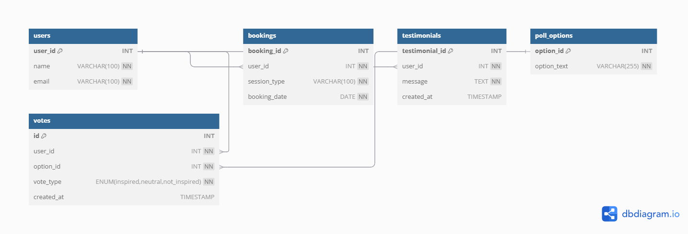

# To Be A Woman

A simple, elegant website celebrating femininity and womanhood.

🌐 **Live site:** [https://femininewoman.netlify.app/](https://femininewoman.netlify.app/)

**To Be A Woman** is a web platform dedicated to empowering women by providing a space to share stories, access resources, and engage with a supportive community. This project implements a Community Content Management System with a MySQL database and a Node.js + Express API, fulfilling two objectives: a complete database management system and a CRUD API.

## Table of Contents

- [Project Overview](#project-overview)
- [Features](#features)
- [Database Schema](#database-schema)
- [Installation](#installation)
- [Usage](#usage)
- [API Endpoints](#api-endpoints)
- [Contributing](#contributing)
- [License](#license)
- [Contact](#contact)

## Project Overview

This repository contains a full-stack application for sharing and managing women's stories. It includes:

1. **Database Management System**: A MySQL database with tables for users, stories, comments, tags, and story-tag relationships, featuring primary/foreign keys, constraints, and sample data.
2. **CRUD API**: A RESTful API built with Node.js + Express, enabling Create, Read, Update, and Delete operations on stories, integrated with MySQL.

The project aims to amplify women's voices and foster community empowerment.

## Features

- **Story Sharing**: Submit and browse personal stories.
- **Community Engagement**: Comment on stories to connect with others.
- **Resource Hub**: Access curated resources on women's empowerment.
- **Responsive Design**: Seamless experience on desktop and mobile.
- **Secure API**: CRUD operations with MySQL backend.

## Database Schema

The MySQL database includes six tables:

- **Users**: User information.
- **Bookings**: Sessions booked by users (1-M with Users).
- **Testimonials**: Feedback from users (1-M with Users).
- **Poll Options**: Available poll choices.
- **Votes**: User votes on poll options (M-M relationship via `votes` table).

**Constraints**:

- Primary Keys (e.g., `user_id`, `option_id`, `booking_id`)
- Foreign Keys (e.g., `user_id` in `bookings`, `testimonials`, and `votes`)
- NOT NULL constraints
- ENUM type for vote classification

**Entity-Relationship Diagram (ERD)**:  
  
_Note_: The ERD is saved as a **JPG** in the `images/` directory. It was generated from the final SQL schema using dbdiagram.io.

## Installation

### Prerequisites

- Node.js (v16+)
- MySQL (v8+)
- Git

### Steps

1. **Clone the Repository**:
   ```bash
   git clone https://github.com/KeruboNancy/To-Be-A-Woman.git
   cd To-Be-A-Woman
   ```
